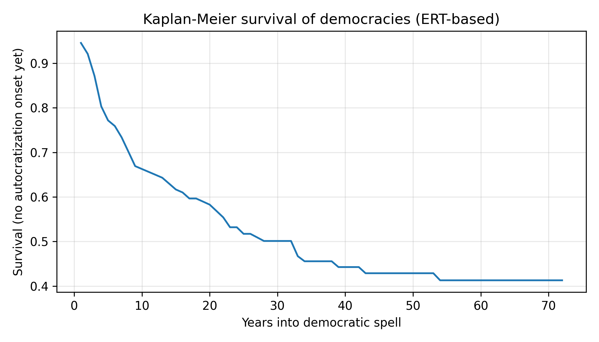
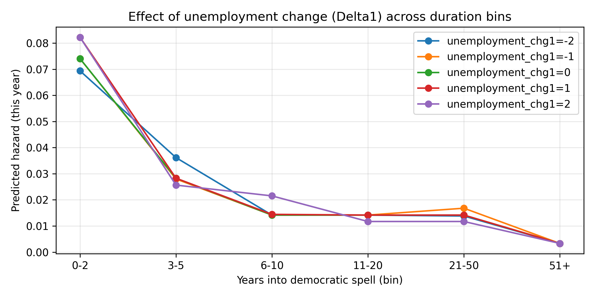

# Democracy Backsliding Risk Model

**Goal**
Estimate the annual risk that a democracy experiences autocratization using
macroeconomic and structural indicators.

**Why this matters**
Democratic erosion is rare but high-impact. A calibrated risk model helps
policymakers distinguish temporary stress from structural vulnerability,
without making deterministic or causal claims.

---

## Data
- **V-Dem Episodes of Regime Transformation (ERT)** for regime-type trajectories and
autocratization onsets.
- **World Bank World Development Indicators (WDI)** for macroeconomic and demographic
covariates.

Raw data are not committed to the repo. See `data/README.md` for indicator lists,
source details, and citation guidance.

---

## Methodology (High-Level)
- **Discrete-time hazard model** with annual observations.
- **Proper democratic risk set construction** (democracy-years with known outcomes).
- **Multi-year outcome horizon**: onset within H years (default H=3), with right-censoring
  when the panel ends before H and no event occurs.
- **No temporal leakage** via lagged and rolling features.
- **Time-based train/test split** (future years held out).
- **Probability calibration** with isotonic regression for interpretability.

This project models **associations** between macro-structural conditions and
risk, not deterministic or causal effects.

---

## Results (Out-of-Sample)
- ROC-AUC approx **0.70**
- PR-AUC approx **2.5x** baseline (rare-event setting)
- Calibrated probabilities (Brier down from **0.22 to 0.026**)

**Why calibration does not change ROC-AUC**  
Calibration rescales probabilities but preserves the *ranking* of cases. ROC-AUC
depends only on ranking (which cases score higher than others), so it is largely
unchanged by calibration. Calibration improves the *probability scale* (e.g.,
"0.10 means about 10% in the long run") without changing discrimination.

---

## Key Insight
Macroeconomic and sociological stress increases *vulnerability*, but does not
deterministically cause collapse. Elite political dynamics mediate outcomes.

---

## Repository Structure
- `data/README.md` - data sources, indicators, and citation guidance
- `notebooks/democracy_backsliding_risk_model.ipynb` - original research workflow
- `src/data.py` - ERT + World Bank ingestion
- `src/features.py` - risk set + lag/rolling feature engineering
- `src/model.py` - discrete-time hazard model + evaluation
- `src/plots.py` - Kaplan-Meier, baseline hazard, simulations
- `results/` - output figures (e.g., `km_curves.png`, `hazard_simulations.png`)

---

## Quickstart
1. Install dependencies:
   ```bash
   pip install -r requirements.txt
   ```
2. Download / build datasets:
   ```python
   from src.data import load_ert, build_wb_panel, DEFAULT_WB_INDICATORS

   ert = load_ert()
   wb = build_wb_panel(DEFAULT_WB_INDICATORS)
   ```
3. Open the notebook or use the `src/` modules to reproduce the pipeline.

## Run End-to-End (Single Command)
Run the full pipeline (data load, features, model, and plots) with:
```bash
python src/run_pipeline.py --horizon 3
```

Outputs are written to `results/`:
- `km_curves.png`
- `baseline_hazard.png`
- `hazard_simulations.png`
- `reliability_calibration.png`

---

## Common Pitfalls Avoided
- **Temporal leakage** from contemporaneous predictors (features are lagged/rolled).
- **Incorrect risk set** (non-democracies and post-event years excluded).
- **Train/test contamination** (time-based split, not random).
- **Misleading metrics** in rare-event settings (PR-AUC + calibration included).

---

## Limitations
- Does not model elite-level decisions directly.
- Country-level aggregation hides subnational dynamics.

---

## Next Steps
- Interaction effects
- Election timing and institutional variables

---

## Figures

**Kaplan-Meier survival of democratic spells**



**Hazard simulations across duration bins**



---

## Citation
If you use this work or derived results, cite:
- V-Dem Institute: **Episodes of Regime Transformation (ERT)**
- World Bank: **World Development Indicators (WDI)**

See `data/README.md` for citation guidance and indicator details.
